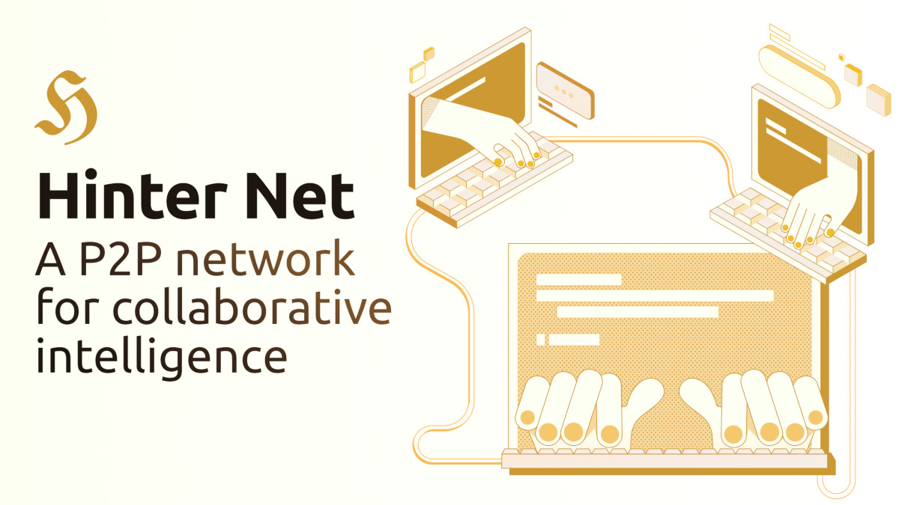

#

**Hinter Net** is a peer-to-peer network for collaborative intelligence, designed to scale human networking and collaboration beyond their natural limits.
By combining a secure, decentralized communication protocol with powerful AI assistance, it enables users—called **hinters**—to build high-trust, private networks.
These networks allow for sharing and contextualizing sensitive information and mapping reputation of relevant actors at a superhuman scale.

This AI-augmented networking experience is delivered through two core applications, which provide the foundational tools for you to build and leverage your own intelligence network:

- **[hinter-core](../hinter-core/introduction.md)**: Powers the secure, peer-to-peer exchange of reports.
- **[hinter-cline](../hinter-cline/introduction.md)**: Serves as the AI-assisted command center for processing intelligence and composing reports.

:::tip Don't Read, Chat!

You can copy-paste [`llms-full.txt`](https://hinter.net/llms-full.txt) to your preferred AI.

:::
